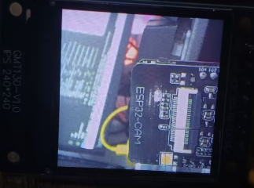

# ESP32CAM

#### Introduction
Shenzhen Sinoseen Technology Co., Ltd.  
ESP32CAM - Camera Example

#### Software Architecture
Based on the IDF framework - version used is IDF v5.1.2

#### Uses Hardware SPI (IOMUX) to Drive LCD (ST7789)
If IOMUX is not feasible, it is recommended to use GPIO matrix.

| LCD   | ESP32 |                    
|-------|-------|
| GND   | GND   | 
| VCC   | 3.3(5)V | 
| SCK   | GPIO14 | 
| SDA   | GPIO13 | 
| RES   | GPIO15 | 
| DC    | GPIO2  | 
| BLK   | Not connected |

#### User Instructions

| model   | max resolution | color type | output format                                                | Len Size |
| ------- | -------------- | ---------- | ------------------------------------------------------------ | -------- |
| OV2640  | 1600 x 1200    | color      | YUV(422/420)/YCbCr422 RGB565/555 8-bit compressed data 8/10-bit Raw RGB data | 1/4"     |
| OV3660  | 2048 x 1536    | color      | raw RGB data RGB565/555/444 CCIR656 YCbCr422 compression | 1/5"     |
| OV5640  | 2592 x 1944    | color      | RAW RGB RGB565/555/444 CCIR656 YUV422/420 YCbCr422 compression | 1/4"     |
| OV7670  | 640 x 480      | color      | Raw Bayer RGB Processed Bayer RGB YUV/YCbCr422 GRB422 RGB565/555 | 1/6"     |
| OV7725  | 640 x 480      | color      | Raw RGB GRB 422 RGB565/555/444 YCbCr 422         | 1/4"     |
| NT99141 | 1280 x 720     | color      | YCbCr 422 RGB565/555/444 Raw CCIR656 JPEG compression | 1/4"     |
| GC032A  | 640 x 480      | color      | YUV/YCbCr422 RAW Bayer RGB565                        | 1/10"    |
| GC0308  | 640 x 480      | color      | YUV/YCbCr422 RAW Bayer RGB565 Grayscale                         | 1/6.5"   |
| GC2145  | 1600 x 1200    | color      | YUV/YCbCr422 RAW Bayer RGB565                        | 1/5"     |
| BF3005  | 640 x 480      | color      | YUV/YCbCr422 RAW Bayer RGB565                        | 1/4"     |
| BF20A6  | 640 x 480      | color      | YUV/YCbCr422 RAW Bayer Only Y                        | 1/10"    |
| SC101IOT| 1280 x 720     | color      | YUV/YCbCr422 Raw RGB                                     | 1/4.2"   |
| SC030IOT| 640 x 480      | color      | YUV/YCbCr422 RAW Bayer                                   | 1/6.5"   |
| SC031GS | 640 x 480      | monochrome | RAW MONO Grayscale                                       | 1/6"     |